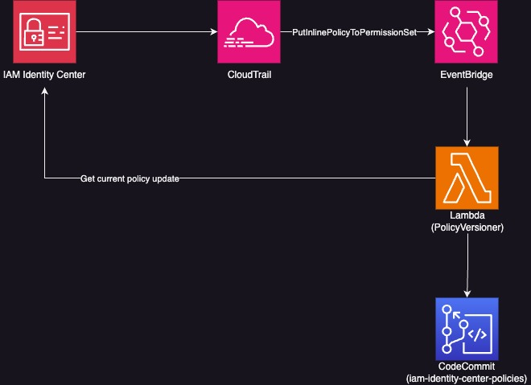

# IAM Identity Center Inline Policy Versioning

Automatically version IAM Identity Center permission set inline policies to CodeCommit.

## Architecture



## Components

- **CodeCommit Repository**: Stores versioned inline policies
- **Lambda Function**: Retrieves policies and commits them to the repository
- **EventBridge Rule**: Triggers on `PutInlinePolicyToPermissionSet` API calls
- **IAM Permissions**: Lambda has access to SSO and CodeCommit APIs

## Quick Start

### Deploy from CloudShell

1. Open AWS CloudShell in your AWS Console
2. Clone and deploy:

```bash
git clone https://github.com/marianachow0321/aws-iam-identity-center-inline-policy-versioning.git
cd aws-iam-identity-center-inline-policy-versioning
npm install
npm run build
npm run deploy
```